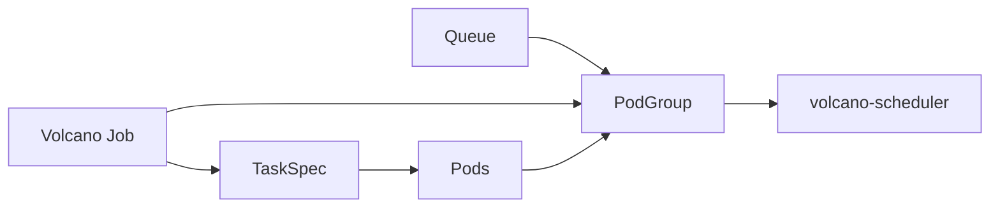
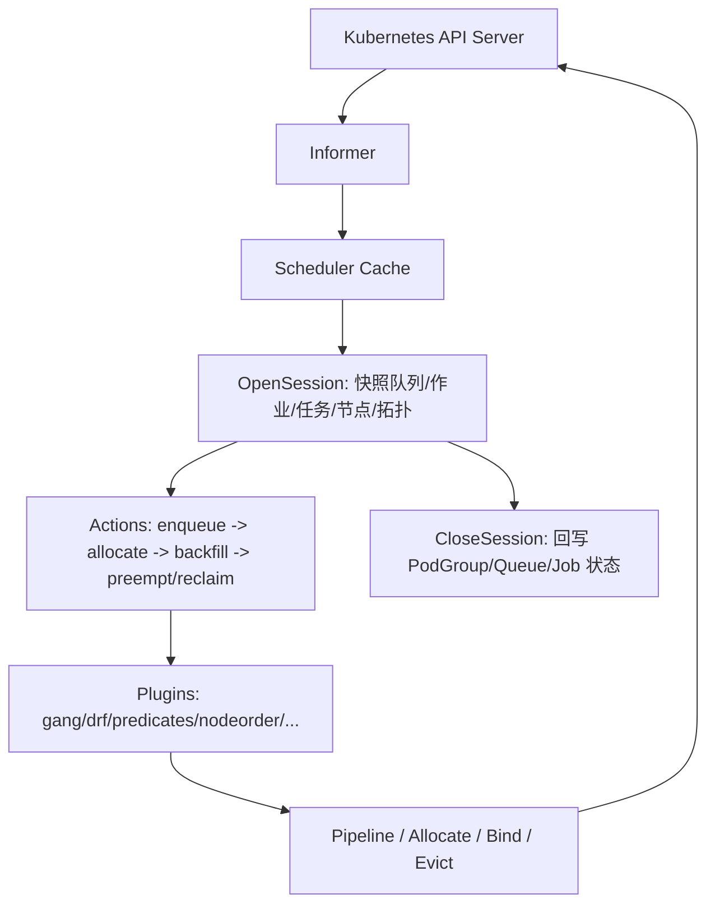

# Volcano 项目架构设计梳理

## 1. 项目定位

Volcano 是一个 Kubernetes 原生的批处理与弹性调度系统，基于 kube-batch 演进而来，用来增强标准 kube-scheduler 在 AI/ML/DL、大数据、HPC、LLM 训练和混部场景下的调度能力。它围绕 Gang 调度、队列公平、优先级抢占、资源回收、GPU/设备共享、NUMA 与网络拓扑感知等能力构建，目标是在 Kubernetes 上更好地运行高性能分布式作业。

从部署形态看，Volcano 的默认控制面由三个核心进程组成：

| 组件 | 入口 | 职责 |
| --- | --- | --- |
| volcano-scheduler | `cmd/scheduler` | 批调度核心，按周期创建调度 Session，执行 Action 流水线并调用插件完成决策 |
| volcano-controllers | `cmd/controller-manager` | 管理 Volcano CRD 生命周期，如 Job、PodGroup、Queue、JobFlow、HyperNode、NodeShard 等 |
| volcano-admission | `cmd/webhook-manager` | 提供 mutating/validating webhook，对 Job、Pod、PodGroup、Queue 等资源做默认值注入和准入校验 |

此外，项目还包含可选的 `volcano-agent`、`volcano-agent-scheduler` 和 `network-qos`。这些组件主要服务于在线/离线混部、节点侧 QoS、资源超卖、网络隔离，以及面向 Agent 类高频短任务的快路径调度。

## 2. 顶层目录与模块划分

| 目录 | 模块说明 |
| --- | --- |
| `cmd/` | 所有可执行程序入口，包括 scheduler、controller-manager、webhook-manager、agent、agent-scheduler、network-qos 和 vcctl |
| `pkg/` | 项目核心实现，包含调度器、控制器、Webhook、Agent、CLI、工具库等 |
| `staging/src/volcano.sh/apis/` | Volcano API 类型、clientset、informer、lister，作为 `volcano.sh/apis` 模块来源 |
| `config/crd/` | CRD YAML 定义，覆盖 Volcano 自定义资源 |
| `docs/` | 用户指南、设计文档、开发文档和排障文档，是理解设计思路的主要参考 |
| `installer/` | 安装清单、Helm Chart、监控和 Agent 部署资源 |
| `example/` | TensorFlow、PyTorch、MPI、Ray、Spark 等框架集成示例 |
| `test/e2e/` | 端到端测试，覆盖调度、作业生命周期、准入、HyperNode、DRA 等能力 |
| `third_party/` | 引入的第三方或派生代码，如 kube-scheduler 队列、mindcluster、hami 等 |
| `hack/` | 本地开发、构建、生成代码和集群启动脚本 |

项目主模块为 `volcano.sh/volcano`，API 模块通过 `replace volcano.sh/apis => ./staging/src/volcano.sh/apis` 使用本仓库中的 staging 目录。当前 `go.mod` 使用 Go 1.25.0，Kubernetes 依赖为 `k8s.io/* v0.35.0` 与 `k8s.io/kubernetes v1.35.0`。

## 3. API 与资源模型

Volcano 的资源模型以 Kubernetes CRD 为核心。调度器、控制器和准入模块都围绕这些 CRD 协作。

| API Group | 主要资源 | 功能定位 |
| --- | --- | --- |
| `batch.volcano.sh` | Job, CronJob | 批处理作业模型，支持多 TaskSpec、生命周期策略、插件和定时触发 |
| `scheduling.volcano.sh` | Queue, PodGroup | 队列与 Gang 调度单元；PodGroup 描述一组 Pod 的最小可运行规模和调度状态 |
| `flow.volcano.sh` | JobFlow, JobTemplate | 作业模板与 DAG 编排，按依赖关系实例化多个 Volcano Job |
| `topology.volcano.sh` | HyperNode | 描述网络/机架/交换机等性能域，用于拓扑感知调度 |
| `shard.volcano.sh` | NodeShard | 描述多调度器分片中的节点集合，用于 Scheduler 和 Agent-Scheduler 协同 |
| `nodeinfo.volcano.sh` | NumaTopology | 描述节点 NUMA 拓扑，服务 NUMA aware 调度 |
| `config.volcano.sh` | ColocationConfiguration | 混部相关配置 |
| `bus.volcano.sh` | Command | 控制器内部命令总线，用于作业控制动作 |
| `training.volcano.sh` | HyperJob | 面向训练场景的高级作业资源 |
| `datadependency.volcano.sh` | DataDependency | 数据依赖相关资源 |

核心对象关系可以概括为：



Job 是高性能作业的主要入口。它通过 `spec.tasks` 描述多个角色或阶段，例如 TensorFlow 的 ps/worker、Spark 的 driver/executor。Job Controller 根据 TaskSpec 创建 Pod，并为作业创建或维护 PodGroup。PodGroup 是 Gang 调度的一等公民，调度器通过 `minMember`、`minResources`、Phase 和 Condition 判断作业是否具备整体运行条件。

Queue 是集群级资源，允许跨 namespace 共享资源。队列的权重、能力上限、保障资源、状态和统计信息共同决定多租户资源分配结果。DRF、proportion、capacity、reclaim、preempt 等插件和 Action 都会围绕 Queue 进行公平性与配额控制。

## 4. 控制面：Controller Manager

Controller Manager 通过 `pkg/controllers/framework` 注册和启动多个控制器。它负责把用户提交的 CRD 转换为 Kubernetes 原生资源和调度器可识别的状态，同时维护 Volcano 自身资源的生命周期。

| Controller | 路径 | 主要职责 |
| --- | --- | --- |
| Job Controller | `pkg/controllers/job` | 根据 Volcano Job 创建 Pod 和 PodGroup，维护 Job 状态机，执行 Job 插件逻辑 |
| PodGroup Controller | `pkg/controllers/podgroup` | 为使用 Volcano scheduler 的普通 Pod 自动创建/关联 PodGroup，并同步状态 |
| Queue Controller | `pkg/controllers/queue` | 维护 Queue 生命周期、状态统计和队列状态转换 |
| JobFlow Controller | `pkg/controllers/jobflow` | 解析 JobFlow DAG，按依赖关系创建 Volcano Job |
| JobTemplate Controller | `pkg/controllers/jobtemplate` | 管理 JobTemplate，供 JobFlow 或用户复用 |
| CronJob Controller | `pkg/controllers/cronjob` | 根据定时规则创建 Volcano Job |
| HyperNode Controller | `pkg/controllers/hypernode` | 管理 HyperNode 拓扑资源，支持 UFM/Label 自动发现 |
| Sharding Controller | `pkg/controllers/sharding` | 根据策略动态划分 NodeShard，支撑多调度器协同 |
| ColocationConfig Controller | `pkg/controllers/colocationconfig` | 同步混部配置 |
| GarbageCollector | `pkg/controllers/garbagecollector` | 清理过期或孤儿资源 |

Job Controller 中还有一组 Job 插件，位于 `pkg/controllers/job/plugins`。这些插件不同于 Scheduler 插件，它们主要修改或补全作业的 Pod 规格和运行环境，例如 env、svc、ssh、MPI、PyTorch、Ray 等，用来适配分布式训练和计算框架。

## 5. 准入层：Webhook

Webhook 模块位于 `pkg/webhooks`，可执行入口为 `cmd/webhook-manager`。它提供 Volcano 资源的 validate 和 mutate 逻辑，典型职责包括：

- 校验 Queue、PodGroup、Job、CronJob、JobFlow、HyperNode 等资源是否符合约束。
- 为 Pod 或 Job 注入默认调度器、队列、PodGroup 关联信息等。
- 在资源创建阶段拒绝不存在、关闭中或不可用队列上的作业。
- 为特定分布式框架补全必要的配置。

准入层承担的是“进入系统之前的规范化和约束校验”，Controller 和 Scheduler 则分别负责“状态转换”和“调度决策”。

## 6. 调度器总体架构

Volcano Scheduler 的核心结构是 Cache + Session + Action + Plugin。



`pkg/scheduler/scheduler.go` 中的 `Run()` 会加载调度配置，启动 cache，然后按 `schedulePeriod` 周期性执行 `runOnce()`。每一轮调度会：

1. 从当前配置中读取启用的 Action、Plugin 和插件参数。
2. 调用 `framework.OpenSession()` 从 Cache 创建一致性快照。
3. 按配置顺序执行每个 Action。
4. Action 在执行过程中调用 Session 中注册的各类插件回调。
5. `framework.CloseSession()` 关闭会话，刷新 PodGroup、Job、Queue 等状态并记录指标。

Session 中的主要对象包括 QueueInfo、JobInfo、TaskInfo、NodeInfo、NamespaceInfo、HyperNodeInfo 等。它也保存插件注册的扩展函数，例如 Job/Queue/Task 排序、Predicate、NodeOrder、Preemptable、Reclaimable、JobReady、JobPipelined、HyperNodeOrder、SubJobReady 等。这样 Action 不需要感知每个具体策略，只需要在调度阶段调用统一扩展点。

## 7. Action 流水线

Action 位于 `pkg/scheduler/actions`，由 `framework.RegisterAction` 注册。当前内置 Action 包括：

| Action | 功能 |
| --- | --- |
| enqueue | 作业入队和队列准入，将符合条件的 Job 放入可调度集合 |
| allocate | 主分配流程，按 Queue、Job、Task 选择节点，完成 Pipeline/Allocate/Bind |
| backfill | 回填空闲资源，在不满足严格份额时尽量提升集群利用率 |
| preempt | 基于优先级等策略抢占低优先级任务 |
| reclaim | 在队列超用或资源借用场景下回收资源 |
| shuffle | 重排或打散任务，服务特定调度策略 |

默认配置定义在 `pkg/scheduler/util.go`：

```yaml
actions: "enqueue, allocate, backfill"
tiers:
- plugins:
  - name: priority
  - name: gang
  - name: conformance
- plugins:
  - name: overcommit
  - name: drf
  - name: predicates
  - name: proportion
  - name: nodeorder
```

`docs/design/execution-flow.md` 描述了 allocate 的典型过程：每个 Session 创建 Queue、Job、PendingTask、Node 的本地副本；按队列顺序取出 Job；对 Task 执行 predicate 与 score；若节点资源充足则分配，否则可进入 pipeline；最后由 Gang 等插件判断 Job 是否达到可运行条件。

## 8. Scheduler Plugin 机制

调度插件位于 `pkg/scheduler/plugins`，由 `framework.RegisterPluginBuilder` 注册。插件通过实现 `OnSessionOpen` 和 `OnSessionClose` 在 Session 生命周期内挂载扩展函数。Action 执行时调用这些扩展函数，从而组合出不同调度策略。

| 插件类别 | 代表插件 | 功能 |
| --- | --- | --- |
| 基础调度 | predicates、nodeorder、priority、conformance | 兼容 Kubernetes 基础过滤、打分、优先级与规则校验 |
| Gang 调度 | gang | 保证 PodGroup 达到 `minMember` / `minResources` 后整体运行 |
| 公平与配额 | drf、proportion、capacity、resourcequota | 队列公平、DRF、层级 DRF、容量配额和 ResourceQuota 集成 |
| 资源策略 | binpack、overcommit、resource-strategy-fit、usage、rescheduling | 资源装箱、超卖、利用率感知和重调度 |
| 拓扑策略 | task-topology、network-topology-aware、nodegroup、numaaware | 任务拓扑、网络拓扑、节点分组和 NUMA aware 调度 |
| 设备共享 | deviceshare、cdp | GPU/NPU 等设备共享与相关策略 |
| 稳定性与保护 | pdb、sla、tdm | PDB、SLA、TDM 等约束 |
| 扩展集成 | extender | 通过 HTTP 调用外部调度服务 |

插件配置支持 tier。高优先级 tier 先参与匹配，低优先级 tier 作为后续策略补充。`docs/design/plugin-conf.md` 中定义的 `actions` 与 `tiers.plugins` 是 Volcano 调度器最重要的策略装配入口。`pkg/scheduler/scheduler.go` 还支持通过 `--scheduler-conf` 文件监听实现热更新。

## 9. Gang、队列公平与资源回收

Volcano 的调度能力围绕批作业整体性和多租户公平性展开。

Gang 调度通过 PodGroup 实现。Job 或普通 Pod 进入系统后会关联 PodGroup，PodGroup 描述最小可运行成员数、最小资源、队列和状态。`gang` 插件在调度过程中注册 `JobReady`、`JobPipelined` 等回调，确保作业没有达到整体运行条件时不会只启动一部分 Pod，从而避免分布式作业死锁或长期占用无效资源。

队列公平由 Queue、DRF、proportion、capacity 等机制共同实现：

- DRF 根据 dominant share 对队列或作业排序，使 CPU、内存、GPU 等多维资源分配更公平。
- proportion 根据队列 weight 计算应得资源份额，避免队列长期超额占用。
- capacity 使用 Queue 的 Capability、Guarantee、Deserved 等字段表达更精细的容量约束。
- reclaim 会在某些队列缺资源且其他队列超用时回收资源。
- preempt 会根据优先级、队列策略和插件约束选择可抢占任务。

backfill 则服务于资源利用率。当严格份额导致资源空闲时，它可以在不破坏核心约束的前提下让合适作业利用剩余资源。

## 10. 拓扑感知调度

拓扑感知主要解决大规模 AI/LLM 训练中的网络和硬件拓扑问题。`docs/design/Network Topology Aware Scheduling.md` 将 HyperNode 定义为一个性能域，可以代表节点集合、交换机、机架、RoCE 网络、NVLink 域等。HyperNode 通过 tier 表达拓扑层级，tier 越低通常代表网络带宽越高、延迟越低。

调度器在 Session 快照中维护 HyperNodeInfo，并额外构造一个虚拟的 `ClusterTopHyperNode` 作为拓扑树根节点，简化后续调度逻辑。`network-topology-aware` 和 `task-topology` 等插件会优先尝试将同一作业或同一子任务组调度到更优性能域中；当低层级域资源不足时，再逐层向上扩展搜索范围。

这类设计使 Volcano 不只是“找一个资源足够的节点”，而是能够把一组通信密集型 Pod 放进更合适的拓扑区域，降低跨交换机或跨网络域通信成本。

## 11. 多调度器与 NodeShard

Volcano 支持两类多调度器模式：

1. 静态多调度器：不同调度器实例使用不同 `--scheduler-name` 和 `--node-selector`，由用户或部署配置隔离节点范围。
2. 动态分片：Sharding Controller 根据资源阈值、节点类型或策略生成 NodeShard，调度器和 Agent-Scheduler 根据 NodeShard 决定可调度节点。

`docs/design/agent-scheduler.md` 中进一步描述了分片协同：NodeShard 的 `spec.nodesDesired` 表达期望节点集合，`status.nodesInUse`、`nodesToAdd`、`nodesToRemove` 用于协调调度器之间的节点切换。调度器可使用 none、soft、hard 三种 sharding mode：none 表示不启用分片；soft 表示优先使用本分片节点；hard 表示只能使用本分片节点。

这套机制的设计目标是让 Volcano Scheduler 与 Agent-Scheduler 这类快路径调度器能够并行处理不同类型工作负载，同时降低多调度器之间的资源冲突。

## 12. Agent、混部与快路径调度

Volcano Agent 运行在节点侧，通常以 DaemonSet 部署。根据 `docs/design/colocation/Overview.md`，它面向在线/离线混部场景提供：

- QoS 模型：LC、HLS、LS、BE 等等级，用于区分在线关键服务和离线批作业。
- CPU burst：允许容器短时间突破 CPU limit，降低在线服务关键时刻的 throttle。
- 动态资源超卖：根据节点实时 CPU/内存使用情况计算 `kubernetes.io/batch-cpu`、`kubernetes.io/batch-memory` 等可供离线任务使用的扩展资源。
- 网络带宽隔离：保障在线业务网络带宽，抑制离线任务对网络资源的影响。
- cgroup v1/v2、eBPF、节点指标采集等节点侧能力。

Agent-Scheduler 则是一个独立的快路径调度器，服务大量高频、低延迟的 Agent 类 Pod。它借鉴 kube-scheduler 的 activeQ、backoffQ、unschedulable pool 队列结构，使用多 worker 并发调度和乐观绑定冲突处理。与 Volcano Scheduler 的固定周期批调度相比，Agent-Scheduler 更强调单 Pod 的低延迟和高吞吐。

## 13. 扩展与集成

Volcano 的扩展机制分布在多个层次：

| 扩展层 | 机制 | 适用场景 |
| --- | --- | --- |
| 调度 Action | 实现 `framework.Action` 并注册 | 新增调度阶段或改变调度流水线 |
| 调度 Plugin | 实现 `framework.Plugin`，在 Session 中注册回调 | 新增过滤、排序、抢占、回收、拓扑等策略 |
| 动态 `.so` 插件 | 使用 `SUPPORT_PLUGINS=yes` 构建并通过 `--plugins-dir` 加载 | 不修改主仓库代码的二进制级插件扩展 |
| HTTP Extender | 启用 extender 插件并配置外部 HTTP 服务 | 非侵入式接入外部调度逻辑 |
| Job 插件 | `pkg/controllers/job/plugins` | 为 MPI、PyTorch、Ray 等框架注入环境变量、服务和启动策略 |
| Webhook | mutate/validate handler | 新增资源默认值和准入校验 |
| EventHandler Framework | 自定义 informer 和事件处理 | 接入 Kubernetes 外部资源管理器或两级调度系统 |

这种设计体现了 Volcano 的基本思路：核心调度循环保持稳定，策略通过配置和插件组合；框架适配放在 Controller/Job 插件；外部系统通过 Extender 或 EventHandler 接入。

## 14. CLI、可观测性与运维

`vcctl` 位于 `cmd/cli` 和 `pkg/cli`，提供队列、作业、JobFlow、JobTemplate、Pod 等资源的运维命令。它面向集群管理员和作业用户，简化 Queue 创建、作业查看、暂停、恢复、取消等操作。

调度器内置 Prometheus metrics，并在每个 scheduling cycle 和 action 执行后更新耗时指标。Scheduler 还支持 cache dumper，用于排查调度器本地视图与 Kubernetes API 状态之间的差异。`pkg/scheduler/scheduler.go` 中通过 fsnotify 监听 `--scheduler-conf` 所在目录，可以在配置文件变更后热加载 actions、plugins、plugin arguments 和 metrics 配置。

运维排障可优先参考：

- `docs/troubleshooting/troubleshooting.md`
- `docs/user-guide/how_to_configure_scheduler.md`
- `docs/user-guide/how_to_tune_volcano_performance.md`
- `docs/design/metrics.md`

## 15. 关键设计思路总结

Volcano 的整体架构可以理解为“声明式 API + 控制器状态机 + 可配置批调度框架 + 节点侧混部能力”。

第一，API 层把批作业、队列、PodGroup、拓扑、分片等概念显式建模，使 Kubernetes 能够理解批处理系统的整体性需求，而不是只看到单个 Pod。

第二，Controller Manager 负责资源生命周期和状态转换。它把 Job、JobFlow、CronJob 等上层资源转成 Pod、PodGroup 和状态条件，让调度器只关注调度快照和策略决策。

第三，Scheduler 采用 Session + Action + Plugin 解耦。Session 提供一轮调度的一致视图；Action 定义调度阶段；Plugin 注入策略。默认行为可开箱即用，复杂场景可通过 scheduler-conf、插件 tier 和扩展点重新组合。

第四，Gang 与 Queue 是调度语义中心。Gang 保证分布式作业整体可运行，Queue 保证多租户资源公平、配额和弹性借还。

第五，拓扑感知、多调度器分片和 Agent-Scheduler 体现了项目面向大规模 AI/LLM 与高并发短任务的演进方向。调度从单纯资源匹配扩展到性能域选择、调度器协同和快慢路径分离。

第六，Agent 将调度决策延伸到节点侧运行时治理，通过 QoS、超卖、CPU burst 和网络隔离提升混部集群的资源利用率，同时保护在线业务。

## 16. 参考文档索引

建议继续阅读以下文档深入理解各专题：

| 主题 | 文档 |
| --- | --- |
| 调度执行流 | `docs/design/execution-flow.md` |
| 动态插件配置 | `docs/design/plugin-conf.md` |
| Job API | `docs/design/job-api.md` |
| Queue 设计 | `docs/design/queue/queue.md` |
| PodGroup 状态 | `docs/design/podgroup-status.md` |
| Gang / minAvailable | `docs/design/task-minavailable.md` |
| DRF / FairShare / Proportion | `docs/design/drf.md`, `docs/design/fairshare.md`, `docs/design/proportional.md` |
| Capacity Scheduling | `docs/design/capacity-scheduling.md` |
| Preempt / Reclaim | `docs/design/preempt-action.md`, `docs/design/reclaim-action.md`, `docs/design/reclaim-design.md` |
| 自定义插件 | `docs/design/custom-plugin.md` |
| HTTP Extender | `docs/design/extender.md` |
| 网络拓扑感知 | `docs/design/Network Topology Aware Scheduling.md` |
| HyperNode 自动发现 | `docs/design/hyperNode-auto-discovery.md` |
| Sharding Controller | `docs/design/sharding_controller.md` |
| Agent-Scheduler | `docs/design/agent-scheduler.md` |
| 混部 | `docs/design/colocation/Overview.md` |
| 性能调优 | `docs/user-guide/how_to_tune_volcano_performance.md` |
| 调度器配置 | `docs/user-guide/how_to_configure_scheduler.md` |
